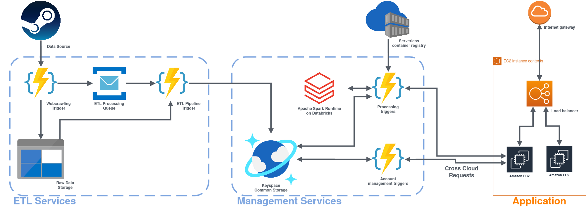

# Big data course

Code from 'Big Data' course in the university

## Objectives

We set ourselves the goal of developing a web hosted application that will provide the user with the following functionality:
 - Store information about the history of price changes for games.
 - Predict the price change for games.
 - Receive notifications about price changes for the game.
 - Leave comments and reviews for the game.
 - Recognize comments and evaluate the game based on them.

## Research questions

In order to fully understand the goal that we set for ourselves and the problem that we want to solve, following questions were formed:
 - Try to schedule the purchase of the game to buy it at a good discount.
 - Try to find all the information you need about the game in one place.
 - Based on comments from other users, try to form an overall rating for the game.

## Expected outcome

As a result of completing the task, we expect to have a web hosted application that is able to:
 - Provide information for user about games and provide history of price changes for the games.
 - Provide information for user about possible price changes and discounts for the games.
 - Send notifications to user about price changes for the followed games.
 - Store users review and recognize them to evaluate the game.

 ## System architecture diagram

 
